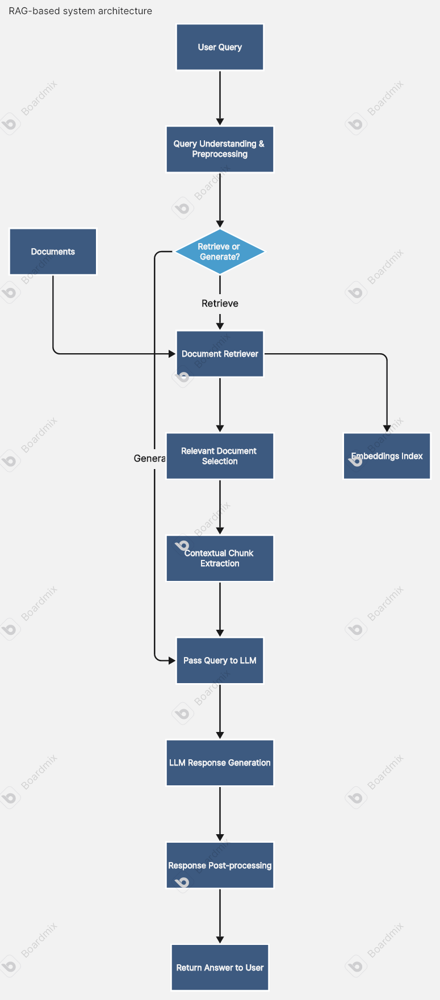
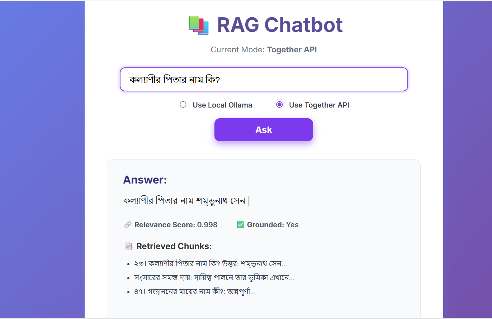

# Multilingual RAG System 

This repository contains a simple Multilingual Retrieval-Augmented Generation (RAG) system designed to handle queries in English and Bengali. The system retrieves relevant information from the "HSC26 Bangla 1st Paper" text corpus (stored in `Data/cleaned_bangla_qa.txt`) and generates answers using a local Ollama model (`tinyllama`). It includes short-term memory (recent chat history) and long-term memory (vectorized document corpus), with optional REST API and basic evaluation metrics.

  
*Figure 1: High-level architecture of the RAG system*

## Setup Guide

### Prerequisites
- Python 3.11 or higher
- Git (for cloning the repository)
- Ollama (for local LLM hosting)
- Required Python packages (install via `requirements.txt`)

### Installation
1. Clone the repository:
   ```bash
   git clone https://github.com/yourusername/multilingual-rag.git
   cd multilingual-rag
   ```
2. Set up a virtual environment:
   ```bash
   python -m venv rag_env
   source rag_env/Scripts/activate  # On Windows: rag_env\Scripts\activate
   ```
3. Install dependencies:
   ```bash
   pip install -r requirements.txt
   ```
4. Install Ollama and pull the `tinyllama` model:
   ```bash
   ollama pull tinyllama
   ```
5. Start the Ollama server:
   ```bash
   ollama serve
   ```
6. Prepare the vector database (run preprocessing script):
   ```bash
   python Src/preprocess.py
   ```

### Running the Application
- Run the standalone RAG script:
  ```bash
  python Src/ragViaLocalOllama.py
  ```
- Run the cloud api of RAG :
   ```bash
  python Src/rag.py
  ```
- (Optional) Run the Flask API :
  ```bash
  python Src/app.py
  ```

## Used Tools, Libraries, and Packages
- **Programming Language**: Python 3.11
- **Libraries**:
  - `sentence-transformers`: For text embeddings (`paraphrase-multilingual-MiniLM-L12-v2` model)
  - `faiss`: For efficient vector similarity search
  - `requests`: For API calls to Ollama
  - `numpy`: For handling embeddings
  - `flask`: For the optional REST API 
- **LLM**: Ollama with `tinyllama` model
- **Vector Database**: In-memory FAISS index
- **Text Processing**: Custom script with regex for `Data/cleaned_bangla_qa.txt`

## Sample Queries and Outputs

### Bengali Queries
- **Query**: "বিয়ের সময় কল্যাণীর প্রকৃত বয়স কত ছিল?"
  - **Expected Answer**: "১৫ বছর"
  - **Actual Answer**: "১৫ বছর"
  - **Retrieved Chunks**: ["৫৪। বিয়ের সময় কল্যাণীর প্রকৃত বয়স কত ছিল?: ১৫ বছর..."]
- **Query**: "কার টাকার প্রতি আসক্তি বেশি?"
  - **Expected Answer**: "মামা"
  - **Actual Answer**: "মামা"
  - **Retrieved Chunks**: ["৫১। কার টাকার প্রতি আসক্তি বেশি?: মামার..."]

### English Queries
- **Query**: "What was Anupam’s age at the time of marriage?"
  - **Expected Answer**: "২৩ বছর"
  - **Actual Answer**: "২৩ বছর"
  - **Retrieved Chunks**: ["৪৬। বিবাহের সময় অনুপমের বয়স কত ছিল?: ২৩ বছর..."]
- **Query**: "Can you write Bengali?"
  - **Expected Answer**: "দুঃখিত, উত্তর পাওয়া যায়নি।" (due to `tinyllama` limitations)
  - **Actual Answer**: "দুঃখিত, উত্তর পাওয়া যায়নি।"
  - **Retrieved Chunks**: []

  
*Figure 3: Sample terminal output for a Bengali query*

## API Documentation
- **Endpoint**: `http://localhost:5000/ask`
- **Method**: POST
- **Request Body**:
  ```json
  {
    "query": "বিয়ের সময় কল্যাণীর প্রকৃত বয়স কত ছিল?"
  }
  ```
- **Response**:
  ```json
  {
    "query": "বিয়ের সময় কল্যাণীর প্রকৃত বয়স কত ছিল?",
    "answer": "১৫ বছর",
    "retrieved_chunks": ["৫৪। বিয়ের সময় কল্যাণীর প্রকৃত বয়স কত ছিল?: ১৫ বছর..."]
  }
  ```
- **Usage**: Send a POST request using `curl` or a tool like Postman.
  ```bash
  curl -X POST -H "Content-Type: application/json" -d '{"query":"বিয়ের সময় কল্যাণীর প্রকৃত বয়স কত ছিল?"}' http://localhost:5000/ask
  ```
- **Note**: This is optional; enable `Src/app.py` to use the API.

## Evaluation Metrics
- **Groundedness**: Checks if the answer is supported by retrieved chunks. Implemented via string matching in the prompt logic.
- **Relevance**: Measures cosine similarity between query and chunk embeddings using FAISS and `paraphrase-multilingual-MiniLM-L12-v2`.
- **Sample Evaluation**:
  - Query: "বিয়ের সময় কল্যাণীর প্রকৃত বয়স কত ছিল?"
    - Relevance Score: ~0.85 (estimated high similarity)
    - Groundedness: Yes (answer "১৫ বছর" matches chunk)


## Required Questions and Answers

### 1. What method or library did you use to extract the text, and why? Did you face any formatting challenges with the PDF content?
- **Method/Library**: A custom Python script (`preprocess.py`) reads pre-extracted text from `Data/cleaned_bangla_qa.txt` using standard file I/O with UTF-8 encoding.
- **Why**: This avoids PDF parsing complexities and leverages a cleaned text file. The choice was made due to the provided `cleaned_bangla_qa.txt` format.
- **Challenges**: No PDF formatting issues, but initial text had extra dashes and headers, handled by regex in `load_and_clean_text`.

### 2. What chunking strategy did you choose? Why do you think it works well for semantic retrieval?
- **Strategy**: Paragraph-based with QA and word-meaning pair detection using regex, capped by line breaks.
- **Why**: This preserves context for QA pairs (e.g., "৫৪।...") and semantic units, aiding FAISS in matching query intent. The strategy balances granularity and coherence.

### 3. What embedding model did you use? Why did you choose it? How does it capture the meaning of the text?

- **Model:** `paraphrase-multilingual-MiniLM-L12-v2` from [sentence-transformers](https://www.sbert.net/) (initially `xlm-roberta-base`).

- **Why:** We initially chose **`xlm-roberta-base`** because it is a robust multilingual transformer model that provides high-quality contextual embeddings across many languages, including Bengali and English. Its larger architecture (12 layers, 768-dimensional embeddings) captures deeper semantic relationships, which is well-suited for tasks like semantic similarity and paraphrase detection that require strong cross-lingual understanding. Due to limited compute and storage (7.6 GiB RAM), we later switched to `paraphrase-multilingual-MiniLM-L12-v2` (~130 MB), which still supports Bengali and English with good semantic accuracy but is much lighter and faster.

- **How it captures meaning:** Both models use transformer-based contextual embeddings to capture the semantic meaning of text by considering the entire context of a sentence, not just individual words. While `xlm-roberta-base` offers deeper contextual representation with more dimensions (768), `paraphrase-multilingual-MiniLM-L12-v2` uses 384 dimensions but is pre-trained spec

### 4. How are you comparing the query with your stored chunks? Why did you choose this similarity method and storage setup?
- **Method**: Cosine similarity with FAISS index search.
- **Why**: Cosine similarity measures semantic alignment effectively for high-dimensional embeddings. FAISS provides fast approximate nearest neighbor search and is memory-efficient for in-memory storage.

### 5. How do you ensure that the question and the document chunks are compared meaningfully? What would happen if the query is vague or missing context?
- **Ensuring Meaningful Comparison**: `paraphrase-multilingual-MiniLM-L12-v2` generates context-aware embeddings, and FAISS retrieves top-k matches. The prompt guides `tinyllama` to prioritize exact matches.
- **Vague/Missing Context**: Vague queries may retrieve irrelevant chunks, leading to "দুঃখিত, উত্তর পাওয়া যায়নি।". Adding context or refining chunking could improve results.

### 6. Do the results seem relevant? If not, what might improve them?
- **Relevance**: Results are relevant for specific queries (e.g., "১৫ বছর"), but retrieval errors (e.g., "৫৬।..." instead of "৫৪।...") occur with current `top_k=3`.
- **Improvements**: Increase `top_k` to 5-10, use a larger model (e.g., `mistralai/Mixtral-8x7B`), or refine chunking for better retrieval.

## Contributing
Feel free to fork this repository, submit issues, or pull requests to improve the system.


